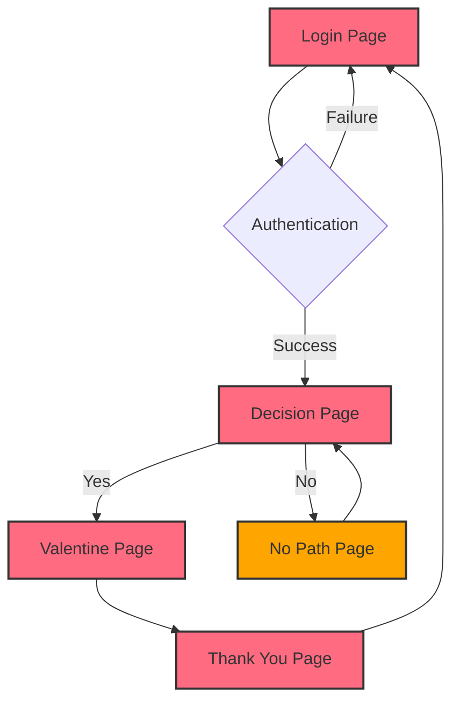

# 💕 Romantic Valentine's Application

<div align="center">


*A beautiful, interactive Valentine's Day application designed to create unforgettable romantic moments*

</div>

## 📖 Table of Contents

- [✨ Features](#-features)
- [🎯 Application Flow](#-application-flow)
- [🛠️ Tech Stack](#️-tech-stack)
- [🚀 Quick Start](#-quick-start)
- [📁 Project Structure](#-project-structure)
- [🎨 Components Overview](#-components-overview)
- [⚙️ Configuration](#️-configuration)
- [🎮 Interactive Elements](#-interactive-elements)
- [📱 Responsive Design](#-responsive-design)
- [🌟 Special Features](#-special-features)
- [🔧 Customization](#-customization)
- [📦 Build & Deploy](#-build--deploy)
- [🤝 Contributing](#-contributing)
- [📄 License](#-license)

---

## ✨ Features

### 🎭 **Interactive Story Flow**
- **Secure Login System** - Personalized authentication for your loved one
- **Decision Page** - Playful "Yes/No" interaction with moving buttons
- **Valentine Celebration** - Animated confetti and romantic messages
- **Thank You Page** - Heartfelt conclusion with memories
- **No Path Page** - Fun redirect when user tries to escape

### 🎨 **Visual Effects**
- **Smooth Animations** - Powered by Framer Motion
- **Cursor Trail Effects** - Romantic cursor following animation
- **Confetti Celebrations** - Canvas-based particle effects
- **Heart Backgrounds** - Animated floating hearts
- **Gradient Backgrounds** - Beautiful color transitions

### 🎮 **Interactive Games**
- **Tic-Tac-Toe** - Romantic version of the classic game
- **Valentine Game** - Special interactive mini-game
- **Antique Chat** - Vintage-style messaging interface

### 🎵 **Multimedia Support**
- **Background Music** - Optional romantic music player
- **GIF Animations** - Funny and romantic animated content
- **Custom Fonts** - Beautiful typography with Google Fonts

---

## 🎯 Application Flow



### 📋 **Page-by-Page Breakdown**

#### 🔐 **1. Login Page** (`Login.jsx`)
- **Purpose**: Secure entry point for the application
- **Features**:
  - Username/Password authentication
  - Custom error messages with humor
  - Shake animation on failed attempts
  - Floating hearts background
- **Default Credentials**: 
  - Username: `hypervisor`
  - Password: `fawad`

#### 💭 **2. Decision Page** (`Decision.jsx`)
- **Purpose**: Interactive decision-making with playful elements
- **Features**:
  - Moving "No" button that escapes cursor
  - Progressive "Yes" button scaling
  - Dynamic "No" button text (20+ variations)
  - Smooth animations and transitions

#### 🎉 **3. Valentine Page** (`Valentine.jsx`)
- **Purpose**: Celebration and confession of love
- **Features**:
  - Canvas confetti animation
  - Romantic message display
  - Auto-progression after celebration
  - Skip option after 8 seconds

#### 🙏 **4. Thank You Page** (`ThankYou.jsx`)
- **Features**:
  - Memory gallery
  - Personalized messages
  - Interactive elements
  - Logout functionality

#### 😄 **5. No Path Page** (`NoPath.jsx`)
- **Purpose**: Fun redirect for "No" button clicks
- **Features**:
  - Humorous messages
  - Retry functionality
  - Playful animations

---

## 🛠️ Tech Stack

### 🎯 **Core Technologies**
- **React 19.2.4** - Modern React with latest features
- **Vite 7.3.1** - Fast build tool and development server
- **JavaScript ES6+** - Modern JavaScript features

### 🎨 **UI & Animation**
- **Framer Motion 12.30.0** - Production-ready motion library
- **Canvas Confetti 1.9.4** - High-performance confetti animations
- **CSS3 Animations** - Custom CSS transitions and keyframes

### 🎭 **Typography & Styling**
- **Google Fonts**:
  - Dancing Script (elegant cursive)
  - Cinzel Decorative (decorative headings)
  - Special Elite (vintage typewriter)
  - Pacifico (playful script)
  - Inter (modern sans-serif)

### 📱 **Progressive Web App**
- **Service Worker** - Offline functionality
- **Web App Manifest** - Mobile app experience
- **Responsive Design** - Works on all devices

---

## 🚀 Quick Start

### 📋 **Prerequisites**
- Node.js 18+ installed
- npm or yarn package manager
- Git for version control

### 🔧 **Installation Steps**

```bash
# Clone the repository
git clone https://github.com/muzairkattana/Romantic-Valentine-s-application.git

# Navigate to project directory
cd Romantic-Valentine-s-application

# Install dependencies
npm install

# Start development server
npm run dev

# Open your browser
# Navigate to http://localhost:5173
```

### 🎮 **Available Scripts**

```bash
# Development server with hot reload
npm run dev

# Build for production
npm run build

# Preview production build
npm run preview

# Run tests (when available)
npm test
```

---

## 📁 Project Structure

```
Romantic-Valentine-s-application/
├── 📄 README.md                 # This documentation
├── 📄 package.json              # Project dependencies and scripts
├── 📄 package-lock.json         # Locked dependency versions
├── 📄 vite.config.js            # Vite configuration
├── 📄 vercel.json               # Vercel deployment settings
├── 📄 .gitignore                # Git ignore patterns
├── 📄 index.html                # Main HTML template
├── 📁 public/                   # Static assets
│   ├── 🖼️ smile.png             # Favicon
│   ├── 🎬 Cats_Dancing_GIF.gif   # Animation asset
│   ├── 🎬 funny-valentine.gif   # Valentine animation
│   ├── 📱 manifest.webmanifest   # PWA manifest
│   └── ⚙️ sw.js                 # Service worker
├── 📁 src/                      # Source code
│   ├── 📄 App.jsx               # Main application component
│   ├── 📄 main.jsx              # Application entry point
│   ├── 📁 components/           # React components
│   │   ├── 🔐 Login.jsx         # Login page component
│   │   ├── 💭 Decision.jsx      # Decision page component
│   │   ├── 🎉 Valentine.jsx     # Valentine celebration
│   │   ├── 🙏 ThankYou.jsx      # Thank you page
│   │   ├── 😄 NoPath.jsx        # No path redirect
│   │   ├── 🎮 TicTacToeGame.jsx # Tic-tac-toe game
│   │   ├── 🎮 ValentineGame.jsx # Valentine mini-game
│   │   ├── 💬 AntiqueChat.jsx   # Vintage chat interface
│   │   ├── 🎵 MusicPlayer.jsx   # Music player component
│   │   ├── ✨ CursorTrail.jsx   # Cursor trail effect
│   │   └── 📸 Memories.jsx      # Memory gallery
│   ├── 📁 styles/               # CSS styles
│   │   └── 🎨 global.css        # Global styles
│   └── 📁 lib/                  # Utility libraries
└── 📁 dist/                     # Build output (generated)
```

---

## 🎨 Components Overview

### 🔐 **Login Component**
```jsx
// Key Features:
- Form validation with custom error messages
- Shake animation on authentication failure
- Floating hearts background animation
- Responsive form design
```

### 💭 **Decision Component**
```jsx
// Interactive Elements:
- Escaping "No" button with random positioning
- Progressive "Yes" button scaling
- Dynamic text changes for "No" button
- Smooth page transitions
```

### 🎉 **Valentine Component**
```jsx
// Celebration Features:
- Canvas-based confetti animation
- Auto-timed progression
- Skip functionality
- Romantic message display
```

### 🎮 **Game Components**
```jsx
// Interactive Games:
- TicTacToeGame: Classic game with romantic theme
- ValentineGame: Custom mini-game
- AntiqueChat: Vintage messaging interface
```

---

## ⚙️ Configuration

### 🎯 **Vite Configuration** (`vite.config.js`)
```javascript
import { defineConfig } from 'vite'
import react from '@vitejs/plugin-react'

export default defineConfig({
  plugins: [react()],
  server: {
    port: 5173,
    open: true
  },
  build: {
    outDir: 'dist',
    sourcemap: true
  }
})
```

### 🌐 **PWA Configuration** (`public/manifest.webmanifest`)
```json
{
  "name": "Romantic Valentine's Application",
  "short_name": "Valentine App",
  "description": "A beautiful Valentine's Day application",
  "theme_color": "#ff6b81",
  "background_color": "#ffffff",
  "display": "standalone"
}
```

### 🚀 **Vercel Deployment** (`vercel.json`)
```json
{
  "buildCommand": "npm run build",
  "outputDirectory": "dist",
  "installCommand": "npm install"
}
```

---

## 🎮 Interactive Elements

### 🖱️ **Cursor Trail Effect**
- Romantic heart trail following cursor movement
- Smooth fade-out animation
- Performance-optimized rendering

### 🎯 **Moving Button Logic**
```javascript
// No button escape mechanism
const handleNoHover = () => {
  const newX = Math.random() * (window.innerWidth - 100)
  const newY = Math.random() * (window.innerHeight - 50)
  setNoPos({ x: newX, y: newY })
  setNoCount(prev => prev + 1)
}
```

### 🎊 **Confetti Animation**
```javascript
// Canvas confetti configuration
const defaults = { 
  startVelocity: 30, 
  spread: 360, 
  ticks: 60, 
  zIndex: 0 
}
```

---

## 📱 Responsive Design

### 📐 **Breakpoints**
```css
/* Mobile Devices */
@media (max-width: 768px) {
  /* Mobile-specific styles */
}

/* Tablets */
@media (min-width: 769px) and (max-width: 1024px) {
  /* Tablet-specific styles */
}

/* Desktop */
@media (min-width: 1025px) {
  /* Desktop-specific styles */
}
```

### 🎨 **Responsive Features**
- **Flexible Layouts** - Adapts to all screen sizes
- **Touch-Friendly** - Optimized for mobile interactions
- **Viewport Meta** - Proper mobile rendering
- **PWA Support** - Installable on mobile devices

---

## 🌟 Special Features

### 🔐 **Authentication System**
- **Custom Login** - Personalized for your loved one
- **Error Handling** - Friendly error messages
- **Security** - Basic client-side authentication

### 🎵 **Music Player** (Optional)
```jsx
// Uncomment in App.jsx to enable
<MusicPlayer />
```
- Background romantic music
- Play/pause controls
- Volume adjustment

### 📸 **Memory Gallery**
- Photo collection display
- Carousel functionality
- Romantic captions

### 💬 **Antique Chat Interface**
- Vintage typewriter effect
- Message history
- Romantic conversation simulation

---

## 🔧 Customization

### 🎨 **Theme Customization**
```css
/* Primary Colors */
:root {
  --primary-pink: #ff6b81;
  --secondary-pink: #ff8fa3;
  --accent-red: #ff4757;
  --heart-red: #ee5a6f;
}
```

### 🔐 **Change Login Credentials**
```jsx
// In src/components/Login.jsx
const handleLogin = (e) => {
  if (username.toLowerCase() === 'your-username' && 
      password.toLowerCase() === 'your-password') {
    onLogin()
  }
}
```

### 📝 **Custom Messages**
```jsx
// In src/components/Decision.jsx
const noTexts = [
  'Your custom message 1',
  'Your custom message 2',
  // Add more personalized messages
]
```

### 🎨 **Font Customization**
```html
<!-- In index.html -->
<link href="https://fonts.googleapis.com/css2?family=Your+Font&display=swap" rel="stylesheet">
```

---

## 📦 Build & Deploy

### 🏗️ **Build for Production**
```bash
# Build the application
npm run build

# Preview the build
npm run preview

# Check build size
npm run build -- --analyze
```

### 🚀 **Deployment Options**

#### **Vercel (Recommended)**
```bash
# Install Vercel CLI
npm i -g vercel

# Deploy to Vercel
vercel --prod
```

#### **Netlify**
```bash
# Build and deploy
npm run build
# Upload dist/ folder to Netlify
```

#### **GitHub Pages**
```bash
# Build for GitHub Pages
npm run build

# Deploy to gh-pages
npm install -g gh-pages
gh-pages -d dist
```

### 🔍 **Environment Variables**
```bash
# Create .env file
VITE_APP_TITLE="My Valentine App"
VITE_API_URL="your-api-url"
```

---

## 🤝 Contributing

### 📋 **How to Contribute**
1. **Fork** the repository
2. **Create** a feature branch (`git checkout -b feature/amazing-feature`)
3. **Commit** your changes (`git commit -m 'Add amazing feature'`)
4. **Push** to the branch (`git push origin feature/amazing-feature`)
5. **Open** a Pull Request

### 🎯 **Development Guidelines**
- Follow existing code style
- Use meaningful variable names
- Add comments for complex logic
- Test on multiple devices
- Keep animations performant

### 🐛 **Bug Reports**
- Use the issue template
- Provide detailed steps to reproduce
- Include browser/device information
- Add screenshots if applicable

---

## 📄 License

This project is licensed under the ISC License - see the [LICENSE](LICENSE) file for details.

### ❤️ **Made with Love**
Created with passion for making Valentine's Day special. Perfect for surprising your loved one with a unique, interactive experience!

---

## 🌟 **Show Your Support**

If this project helped you create a beautiful Valentine's surprise:

⭐ **Star the repository** - It helps others find this project

🔄 **Share** - Let others know about this romantic application

💝 **Contribute** - Help make it even better for everyone

---

## 📞 **Get in Touch**

- **GitHub**: [@muzairkattana](https://github.com/muzairkattana)

---

<div align="center">

**💕 Happy Valentine's Day! 💕**

*Made with ❤️ for someone special*

</div>
